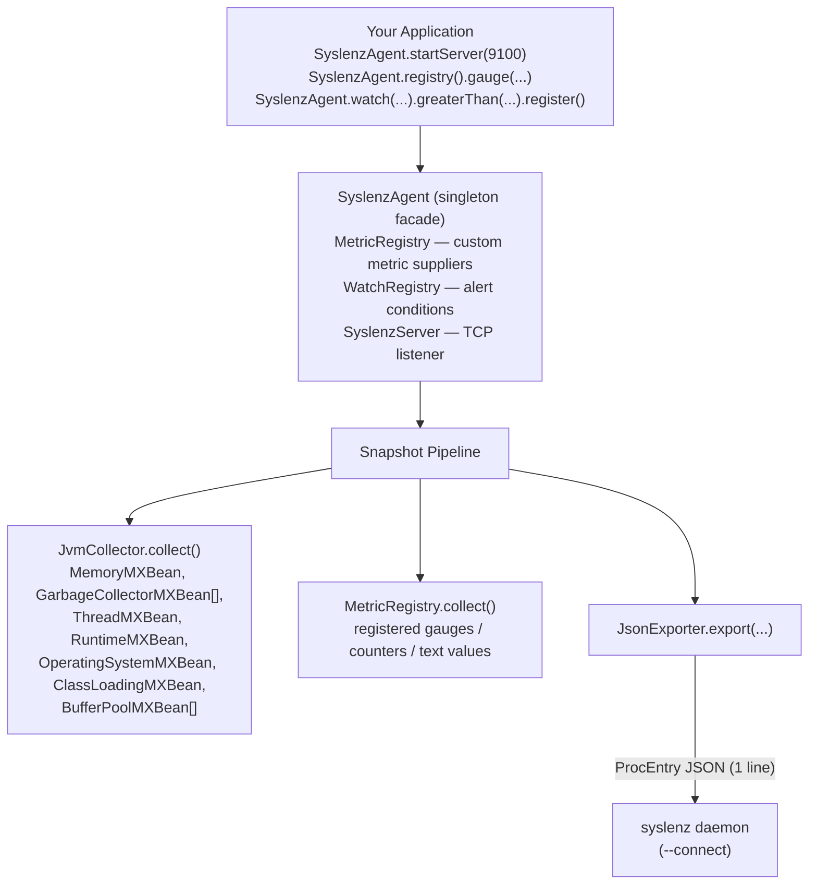
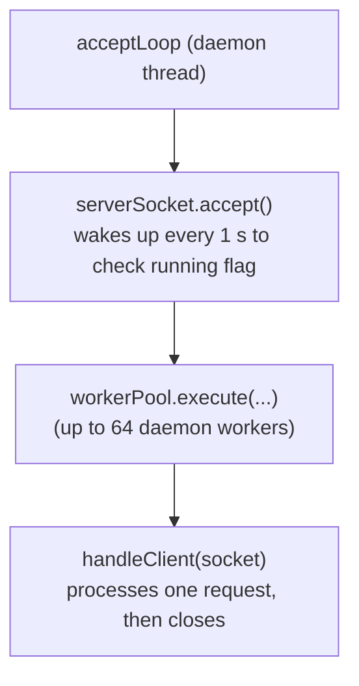
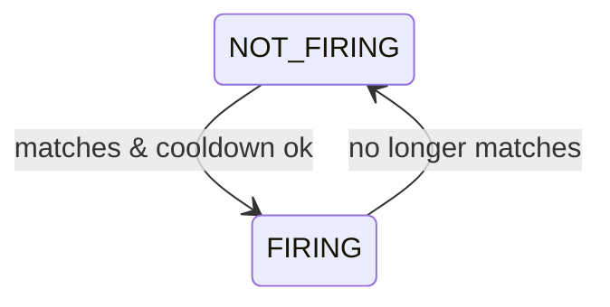

[日本語版](architecture-ja.md)

# Architecture

syslenz4j is a zero-dependency Java library that bridges JVM internals to the syslenz monitoring daemon. This document covers the component model, data flow, protocol, and the Watch API internal design.

---

## Component Overview



---

## MXBean Collection Model

All JVM data is sourced from `java.lang.management` — no native libraries, no JVM agents, no reflection hacks.

### Memory (MemoryMXBean)

`MemoryMXBean` provides two `MemoryUsage` structures: heap and non-heap. Each carries `used`, `committed`, and `max`. syslenz4j collects all five numeric values as individual metrics.

Non-heap includes: Metaspace, Code Cache, Compressed Class Space. The `max` for non-heap is often `-1` (unlimited) and is intentionally excluded from the exported fields.

### Garbage Collection (GarbageCollectorMXBean[])

There may be multiple GC collectors (e.g. G1 Young Generation + G1 Old Generation). syslenz4j iterates all beans and creates per-collector metrics using a safe name derived from `gc.getName()` with non-alphanumeric characters replaced by `_`.

Aggregated totals (`gc_total_count`, `gc_total_time`) sum across all collectors.

### Threads (ThreadMXBean)

`findDeadlockedThreads()` is called on every snapshot. It returns `null` if no deadlock is detected (mapped to `0`) or an array of thread IDs if a deadlock exists. This is a moderately expensive operation; if snapshots are very frequent (< 1 s), consider moving deadlock detection to a lower-frequency path.

### Operating System (OperatingSystemMXBean / com.sun.management)

The standard `OperatingSystemMXBean` provides `getSystemLoadAverage()` and `getAvailableProcessors()`. Process-level CPU metrics (`getProcessCpuLoad()`, `getProcessCpuTime()`) require the `com.sun.management.OperatingSystemMXBean` extension, which is available in Oracle JDK and OpenJDK but not guaranteed by the Java SE spec. syslenz4j uses an `instanceof` check and skips these metrics on JVMs that don't provide the extension.

### Buffer Pools (BufferPoolMXBean[])

`ManagementFactory.getPlatformMXBeans(BufferPoolMXBean.class)` enumerates direct and memory-mapped buffer pools (typically two pools: `direct` and `mapped`). Each pool reports `memoryUsed`, `totalCapacity`, and `count`.

---

## JsonExporter and ProcEntry Format

`JsonExporter` produces the syslenz ProcEntry JSON format using string concatenation — no external JSON library. This keeps the library dependency-free at the cost of not supporting arbitrary metric value types beyond: `Bytes`, `Integer`, `Float`, `Duration`, `Text`.

Each metric field is serialized as:

```json
{
  "name": "heap_used",
  "value": {"Bytes": 524288000},
  "unit": null,
  "description": "Current heap memory usage"
}
```

The `value` field uses a tagged union: the JSON key is the type name. This mirrors the syslenz Rust enum serialization (serde's `externally tagged` format).

The full snapshot is wrapped in:

```json
{
  "source": "jvm/pid-<pid>",
  "fields": [ ... ]
}
```

The `source` field is resolved once per snapshot using `ProcessHandle.current().pid()` (Java 9+).

---

## Protocol

```
TCP connection on port P
  Client → "SNAPSHOT\n"
  Server → "<single-line JSON>\n"
  (close after the response)
```

- The server reads lines with `BufferedReader.readLine()`, strips trailing whitespace, and matches `SNAPSHOT` case-insensitively.
- One request per connection: after sending the snapshot the server closes the socket, because the syslenz client reads until EOF.
- Unknown commands get an `ERROR unknown command: <cmd>\n` response, then the connection is closed. `QUIT` or an empty line closes without a response.
- The response JSON has all internal newlines stripped before sending, guaranteeing the `\n` delimiter is unambiguous.
- Connection timeout: 30 seconds of inactivity closes the socket.

### Server Threading Model

`SyslenzServer` uses a single daemon thread to accept connections; each accepted socket is dispatched to a fixed pool of at most 64 worker threads. When all workers are busy, new connections are closed immediately, preventing slow or idle clients from causing unbounded thread growth:



Connections are handled concurrently on the worker pool, so multiple syslenz clients can connect at once. `stop()` shuts the pool down and waits up to 5 s for in-flight handlers to finish.

---

## Watch API Internal Design

### Registration

`SyslenzAgent.watch(metricName)` constructs a `WatchCondition` and returns it. Calling `.register()` on the builder adds it to `WatchRegistry`. The builder holds all configuration immutably after `register()`.

```java
SyslenzAgent.watch("heap_used")
    .greaterThan(1_073_741_824L)
    .severity(Severity.WARNING)
    .cooldown(60_000)
    .onFire(callback)
    .register();
// → WatchRegistry.add(WatchCondition)
//   → entries: CopyOnWriteArrayList<WatchEntry>
```

### Evaluation

`WatchRegistry.evaluate(Map<String, Double>)` is called with the current metric snapshot. For each registered condition:

1. Look up the metric value from the map.
2. Evaluate the primary operator.
3. If a compound condition exists (`.and()`), evaluate the secondary operator.
4. **State machine** (per `WatchEntry`):
   - `wasFiring=false` + condition matches + cooldown elapsed → fire `onFire`, set `wasFiring=true`
   - `wasFiring=true` + condition no longer matches → fire `onResolve`, set `wasFiring=false`
   - All other combinations: no callback

The cooldown prevents repeated `onFire` invocations when a metric hovers near the threshold.



### Evaluation Wiring (since v1.1.1)

`SyslenzServer.collectSnapshot()` builds a `Map<String, Double>` from every JVM + custom metric and passes it to `WatchRegistry.evaluate()` on each `SNAPSHOT` request, then attaches the firing watches as the snapshot's `alerts` array. Watch callbacks therefore fire automatically whenever a client polls. To evaluate even while no client is connected, start the self-driven evaluator with `SyslenzAgent.evaluateEvery(Duration)`.

### Compound Condition Chain (since v1.1.1)

`CompoundCondition.greaterThan()` / `lessThan()` / `greaterThanOrEqual()` / `lessThanOrEqual()` all return the parent `WatchCondition`, so `.and("x").greaterThan(v)` chains normally back into the builder. The secondary condition evaluates the same threshold semantics as the primary condition for these four operators.

---

## JVM Embedded Model

syslenz4j is designed to run inside the monitored JVM — not as a separate agent or sidecar. This has the following implications:

**Advantages:**
- Access to all MXBeans without JMX remote configuration
- Zero-latency metric collection (in-process)
- No separate process to manage or restart

**Tradeoffs:**
- The TCP server shares the JVM's thread pool and memory; if the JVM is crashing, the server may stop responding
- GC pressure from metric collection itself (minimized by using primitive-friendly code paths)
- Memory overhead: approximately 50–200 KB for all registered conditions and metric history

### Deployment Modes

| Mode | Use case | How |
|------|----------|-----|
| Server mode | Long-running services | `SyslenzAgent.startServer(port)` |
| Plugin mode | Batch jobs, one-shot tools | `SyslenzAgent.printSnapshot()` |
| Spring Boot | Managed lifecycle | See [getting-started.md](getting-started.md) |

---

## Thread Safety

| Component | Thread-safety guarantee |
|-----------|------------------------|
| `SyslenzAgent` | All static methods are thread-safe; `startServer()` is idempotent via double-checked locking |
| `MetricRegistry` | `ConcurrentHashMap` — registrations and `collect()` are safe from any thread |
| `WatchRegistry` | `CopyOnWriteArrayList` protects registration changes; synchronized `evaluate()` serializes state transitions and callbacks across snapshot workers and the self-driven evaluator |
| `SyslenzServer` | Single daemon thread; `start()`/`stop()` are safe to call from any thread |
| Supplier callbacks | The library does not synchronize supplier calls — suppliers must be thread-safe themselves |
