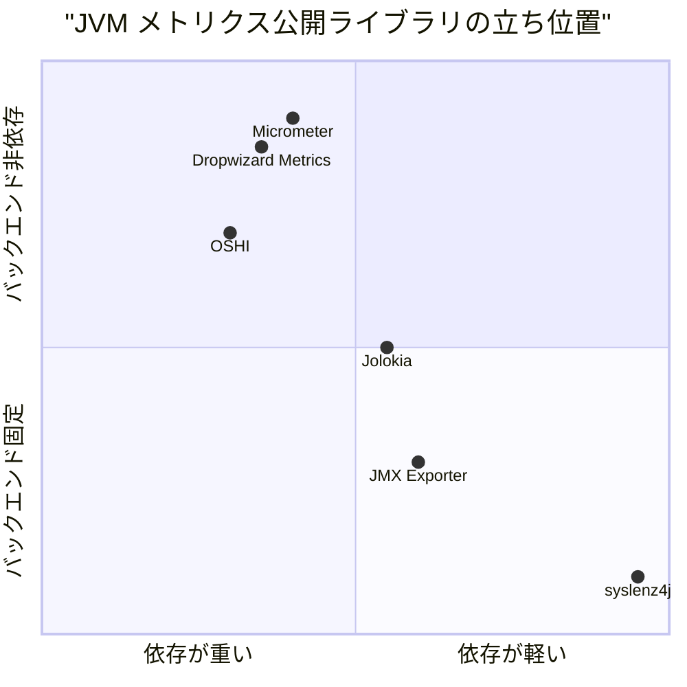
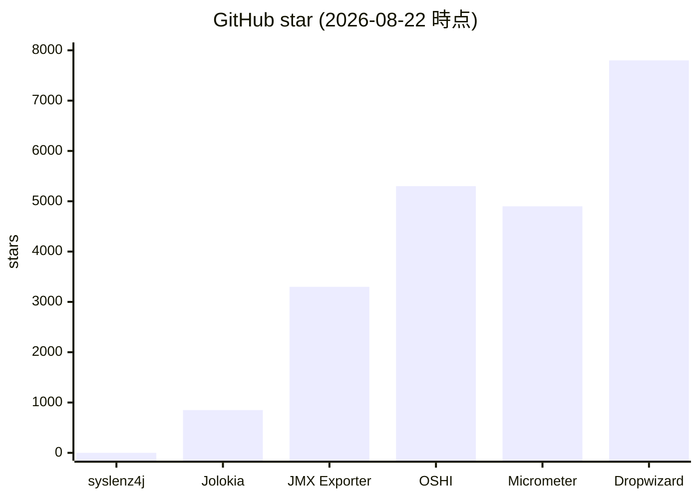
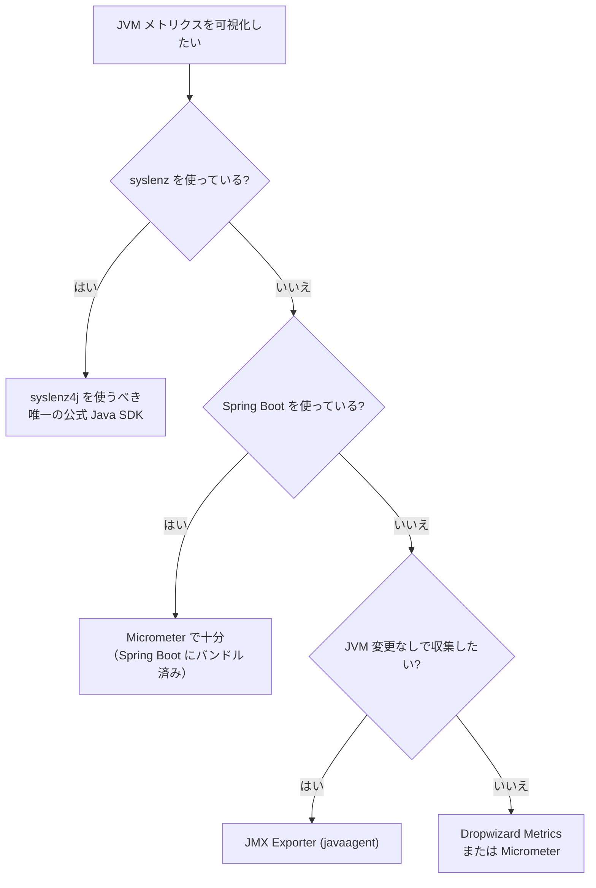

# 0. 要約

- **立ち位置**: syslenz（Rust 製ローカルシステムモニタ）の Java SDK として、JVM メトリクスを zero-dependency で TCP 経由で syslenz に橋渡しするニッチプラグ。Micrometer/Dropwizard が支配する汎用メトリクス市場の外にいる。
- **最大の弱点**: 単体では価値を出さない — syslenz 本体がインストール済みであることが前提。syslenz 自体が star 0 の個人プロジェクトで、採用実績が未知数。
- **次の一手**: Watch API の複合条件の評価バグ（README に既知制約として書かれている v1.1.1 の secondary metric 問題）を修正し、API の完全性を保証すること。

# 1. このrepoは何か

- **一言**: Java アプリに組み込んで JVM 内部メトリクス（heap・GC・thread・CPU・buffer pool 等 28 種）を MXBean 経由で収集し、syslenz TUI が読める TCP プロトコルで公開する zero-dependency ライブラリ。
- **提供価値**: Java アプリの運用者が、syslenz で OS/ネットワークを見ているのと同じ TUI に JVM の内情も統合表示できる。「syslenz --connect localhost:9100」一本で JVM も OS も同時に見える。
- **想定利用者**: syslenz を使っている SRE / 開発者で、JVM アプリの運用も兼ねる人。syslenz 自体が Linux システム管理と教育を兼ねたツールなので、JVM の教育コンテンツを見たい学習者も含む。
- **到達点の客観指標**:
  - ソース LOC: 1,497 行（main）、1,382 行（test） — テスト比率 48%（main 対 test）
  - 公開 API 数: 50 メソッド（SyslenzAgent ファサード + MetricRegistry + WatchCondition fluent builder）
  - テスト数: 59 @Test アノテーション（8 テストファイル）。mvn test は未実行（Maven が環境に無いため）
  - 依存パッケージ数: 0（runtime）。テスト依存: JUnit Jupiter 5.10.2 のみ
  - ライセンス: MIT（pom.xml 宣言、LICENSE ファイルは未配置）
  - Maven Central 公開: あり（`org.unlaxer.infra:syslenz4j:1.1.1`）
  - 稼働状況: MCP skill-only として volta に参加済み（namespace `syslenz4j`）
  - 最終コミット: 2026-08-22（ac563b0）

この repo は **syslenz と組み合わさって初めて価値を出す**。単体では JVM メトリクスを TCP に吐くだけのサーバで、読み手が syslenz でなければならない（プロトコルが syslenz 専用）。したがって比較対象は「JVM メトリクスを可視化するシステム全体」ではなく、**「JVM メトリクスを外部ツールに橋渡しするライブラリ」** とする。syslenz 本体との組み合わせで「JVM + OS 統合モニタ」を作る仕事の比較対象は、JVM メトリクスを別の可視化・監視バックエンドに橋渡しするライブラリ群である。

# 1.5 調査の型

`library` — コードが読める。比較の主軸は機能＋実装（API 面・依存の重さ・実装方針・テスト量・配布サイズ）。証拠の強さは強い（自分で読んで検証できる）。

confidence は **高** とする。理由: 比較対象のリポジトリを GitHub で確認し、star 数・ライセンス・README から機能・アーキテクチャを読んだ。自 repo のコードは全ファイルを読んだ。ただし比較対象のコードを clone して読んではいない（公開 API の規模は README とディレクトリ構成から推定）。

# 2. 比較対象と選定理由

| 製品 | 何ができるか | 採用状況 | ライセンス | うちとの決定的な違い | なぜ選んだか |
|---|---|---|---|---|---|
| **Micrometer** | JVM/アプリメトリクスを vendor-neutral に収集し、Prometheus/Datadog/Graphite 等に転送する facade。Spring Boot にデフォルトバンドル | ★4.9k / 8,930 commits / 活発（2026-08 確認） | Apache-2.0 | バックエンドが syslenz ではなく Prometheus 等の標準的時系列DB。依存多数・モジュール分割。Spring Boot があれば実質ゼロ設定 | JVM メトリクス収集の事実上の標準。syslenz4j が Micrometer のブリッジ例を README に出している（Spring Boot Integration）ため直接比較可能 |
| **Dropwizard Metrics** | JVM/アプリメトリクス収集ライブラリ。Meter/Gauge/Counter/Histogram/Timer + JMX/Graphite/HTTP 出力 | ★7.8k / 4,248 commits / 活発（2026-08 確認） | Apache-2.0 | Micrometer の前身的存在。より古く、モジュール数が多いが API は安定。JVM 専用モジュール `metrics-jvm` が別途必要 | Micrometer の前世代。JVM メトリクス収集ライブラリとしての歴史的標準。zero-dependency との対比で重要 |
| **JMX Exporter** | JMX MBean を Prometheus exposition format に変換する agent（javaagent / standalone） | ★3.3k / 1,110 commits / 活発（2026-08 確認） | Apache-2.0 | アプリ組み込み型ではなく javaagent または外部プロセス。設定は YAML。JMX 全体を公開するが、メトリクスの選別はユーザ責任 | 同じ「JVM MBean → 外部ツール」の橋渡しだが、アプローチが agent 型 vs 組込型。ゼロ設定 vs YAML 設定の対比 |
| **OSHI** | OS/ハードウェア情報を JNA/FFM でクロスプラットフォームに収集するライブラリ。JVM メトリクスは含まないがシステムモニタリングの文脈で比較 | ★5.3k / 4,036 commits / 活発（2026-08 確認） | MIT | OS/ハードウェア層の情報収集に特化。JVM 内部は見ない。JNA 依存（native access）。Micrometer 連携モジュールあり | syslenz4j が JVM 層を担当するのと対称的に、OSHI は OS/ハードウェア層を担当する。「syslenz = OS + JVM」に対して「OSHI + Micrometer = OS + JVM」の構図になる |
| **Jolokia** | JMX MBean を JSON over HTTP で公開する agent。REST API で外部から JMX 操作が可能 | ★850 / 3,166 commits / 活発（2026-08 確認） | Apache-2.0 | 双方向（読み書き）の JMX アクセス。HTTP/JSON ベースで firewall friendly。監視だけでなく運用操作も想定 | JMX を外部に公開するという点では同じだが、プロトコル（HTTP/JSON vs TCP/ProcEntry）と目的（汎用JMX vs 監視特化）が違う |

この分野は **Micrometer がデファクト標準として寡占している**。Dropwizard Metrics はその前世代で、現在は Micrometer に移行済みのプロジェクトが多い。JMX Exporter は Prometheus エコシステム固有。OSHI は OS 層に特化。Jolokia は JMX の汎用 HTTP 化。

syslenz4j はこの地図のどこにも乗らない — syslenz という独自バックエンド専用のブリッジだから。比較する意味は「JVM メトリクスを外部に橋渡しする選択肢として、syslenz4j という独自ルートがいつ選ばれるか」を明らかにすることにある。

# 3. ポジショニング

x軸: ランタイム依存の重さ（ゼロ依存=1.0、多数依存=0.0）。y軸: バックエンドの自由度（任意=1.0、固定=0.0）。syslenz4j は依存ゼロで右端だが、バックエンドが syslenz 専用で下端に位置する。

# 4. 機能比較

| 機能 | 重み | うち (syslenz4j) | Micrometer | Dropwizard Metrics | JMX Exporter | OSHI | Jolokia |
|---|---|---|---|---|---|---|---|
| JVM メトリクス収集 (heap/GC/thread) | ◎必須 | ○ 28種 MXBean | ○ metrics-jvm | ○ metrics-jvm | ○ 全MBean | × JVM外 | ○ 全MBean |
| カスタムメトリクス登録 | ◎必須 | ○ gauge/counter/text | ○ 5種 | ○ 5種+Histogram | △ YAML設定 | × 読取専用 | × JX既存MBean |
| アラート/Watch (閾値通知) | ○効く | ○ fluent API 内蔵 | × 別途Alertmanager | △ healthchecks | × 別途 | × | × |
| 複合条件 (AND) | △あれば | △ v1.1.1 に既知バグ | ○ 組み合わせ可能 | △ 要自前 | × | × | × |
| TCP サーバ (組込) | ○効く | ○ syslenz プロトコル | × push 型 | △ HTTP/JMX | ○ HTTP server | × | ○ HTTP server |
| ランタイム依存ゼロ | ○効く | ○ ゼロ | × 多モジュール | × 多モジュール | × snakeyaml | × JNA | × |
| バックエンド選択の自由 | — | × syslenz 専用 | ○ 多数 | ○ 多数 | × Prometheus 専用 | × Micrometer 専用 | △ 任意だが JMX |
| バックエンド側の可視化・教育 | ○効く | ○ syslenz TUI/Web/教育 | △ 別途Grafana等 | △ 別途 | △ Grafana | × | × |
| Spring Boot 連携 | △あれば | △ README例あり | ○ デフォルト | ○ starterあり | △ javaagent | × | △ WAR deploy |
| Maven Central 公開 | ◎必須 | ○ あり | ○ あり | ○ あり | ○ あり | ○ あり | ○ あり |
| 決定論性 (同じ入力→同じ出力) | △あれば | ○ (PRNG seed対応) | × | × | ○ | × | × |

凡例: ○=ある / △=部分的・要設定 / ×=無い ／ 重み: ◎=この立ち位置で必須 / ○=効く / △=あれば良い / —=不要（むしろ入れない方が良い）

この表から読み取れること:

- **syslenz4j の差別化は「依存ゼロ + Watch API 内蔵 + syslenz TUI」の三点セット**に集中している。Micrometer は機能で圧倒するが、これら3点では負けている（依存多数・アラートは別途・TUI は別途用意）。
- **× のうち痛いもの**: バックエンド選択の自由（重み — だが立ち位置上やむを得ない）。複合条件のバグ（重み △ だが API として公開している以上修正すべき）。
- **○ のうち実は差別化になっていないもの**: Maven Central 公開は全員 ○ なので差別化にならない。決定論性は syslenz4j の独自性だが、誰もそれを求めていない可能性がある。

# 4.5 コード・実装の比較

| 観点 | うち (syslenz4j) | Micrometer | Dropwizard Metrics | JMX Exporter | 出典 |
|---|---|---|---|---|---|
| 公開API数 | 50 メソッド | 推定 数千（多数モジュール） | 推定 数百（30+ モジュール） | 推定 数十（agent中心） | 自 repo: `grep` で計測 / 他: README とディレクトリ構成から推定 |
| 依存パッケージ数 (runtime) | 0 | 多数（モジュールごと） | 多数（モジュールごと） | snakeyaml, prometheus | 自 repo: pom.xml / 他: README 記載 |
| テスト数 | 59 @Test | 推定 数千 | 推定 数千 | 推定 数百 | 自 repo: `grep @Test` / 他: CI status から推定 |
| 配布サイズ (JAR) | 推定 < 100 KB | 数 MB（モジュールごと） | 数 MB | ~500KB | (推測) ソース1,497行・依存ゼロから推定。実際に jar を計測していない |
| ライセンスの制約 | MIT | Apache-2.0 | Apache-2.0 | Apache-2.0 | pom.xml / README |

実装方針の違い:

- **syslenz4j**: singleton facade（`SyslenzAgent`）+ fluent builder（`WatchCondition`）。手書き JSON シリアライザ（`JsonExporter`）で依存ゼロを実現。MXBean → typed Metric → JSON の流れが一本道で、拡張点は `MetricRegistry` の supplier 関数登録のみ。**「小さく閉じる」ことを選んでいる**。
- **Micrometer**: facade パターンで `MeterRegistry` をバックエンドごとに差し替え。dimensional metrics（tags 付き）。観測（Observation API）も統合。**「大きく開く」ことを選んでいる** — 拡張性が価値。
- **JMX Exporter**: agent 型（アプリコード変更不要）。YAML で MBean → メトリクス名のマッピングを定義。**設定駆動**でコードを書かない前提。

syslenz4j の「ゼロ依存・小さい」は、syslenz というバックエンドが決まっている状況では正当な選択である — 拡張性よりも「組み込んで3行で動く」ことを優先している。

# 5. 採用状況

syslenz4j と親プロジェクト syslenz は共に star 0 である。比較対象が最低 850（Jolokia）〜 7,800（Dropwizard）であることと対照的。**これは市場での認知度がまだ無いことを示すだけで、技術的優劣ではない** — 個人プロジェクトで公開直後だから。ただし、syslenz 本体の採用が増えなければ syslenz4j も増えないという構造的制約がある。

# 5.5 調査者の見立て

**何が本当の勝負所か**: 機能比較表では ○× が並ぶが、実際に選択を左右するのは **「syslenz 本体が普及するかどうか」一点** である。syslenz4j 単体の出来がどれだけ良くても、syslenz が使われなければ bridge の価値はゼロ。逆に syslenz が普及すれば、JVM を syslenz に繋ぐ唯一の公式 SDK として自動的に需要が来る。 Micrometer に対して機能で勝つ必要はなく、syslenz エコシステムの一番目の Java SDK でい続ければよい。

**数字に出ていないが気になること**: README に v1.1.1 の既知制限として「複合条件の secondary metric の `>=` / `<=` が常時 true として評価される」バグが書かれている。これは API として公開している機能のバグであり、ユーザが踏む可能性が高い。また `mvn test` が CI に見当たらない（GitHub Actions の設定を確認していないが、リポジトリには `.github/workflows` が存在するか未確認）。テストは 59 件あるが、これらが CI で走っているかが信頼性に直結する。

**自分ならどうするか**: syslenz4j の立場なら、次の一手は「バグ修正」ではなく「syslenz 本体の可視性向上」に投資する。syslenz4j のコード品質は既に十分（1,497 行・59 テスト・ゼロ依存）で、今は機能追加よりも需要創造フェーズだから。ただし、既知バグは放置すると早期ユーザの信頼を削ぐので、最小コストで直す。

**この見立てが外れるとしたら**: syslenz が JVM 以外の SDK（Python/Node と呼ばれるもの）を先に普及させ、Java だけ遅れた場合、Java ユーザが Micrometer → Prometheus で代替して syslenz4j の存在意義が薄れる。また、Micrometer が zero-dependency の JVM-only サブセットを切り出した場合、syslenz4j の最大の差別化（依存ゼロ）が消える。前者は確信を持てないが、後者は低確率だと考える — Micrometer は拡張性が価値なので、依存を削る方向に動く動機が無い。

# 6. 提案

| 順 | 提案 | 分類 | 根拠 | 最小の一手 | 効きそうな指標 |
|---|---|---|---|---|---|
| 1 | 複合条件の secondary metric 評価バグを修正する | 埋める | README に既知制限として書かれている v1.1.1 バグ。API として公開している以上、正しく動くべき。4節で△ | `CompoundCondition` の `greaterThanOrEqual` / `lessThanOrEqual` の評価ロジックを `greaterThan` / `lessThan` と同じ経路を通す | `WatchConditionOperatorsTest` の該当ケースが通る |
| 2 | syslenz 本体の README に syslenz4j へのリンクを prominent に置く | 伸ばす | syslenz4j の需要は syslenz 本体の普及から来る。syslenz README の SDK 節は既にあるが、star 0 なので発見性が要る | syslenz repo の README SDK 節に「Java: syslenz4j (Maven Central)」を太字で追加 | syslenz4j の Maven Central ダウンロード数 |
| 3 | GitHub Actions CI で `mvn test` が走ることを確認・可視化する | 埋める | 59 テストがあるが CI で走っているか未確認。バッジが README に無い。信頼性の証明 | `.github/workflows/ci.yml` を追加し README に badge を置く | CI badge が緑になる |
| 4 | LICENSE ファイルをリポジトリルートに配置する | 埋める | pom.xml では MIT 宣言だが、ルートに LICENSE ファイルが無い。Maven Central 公開要件としても必要 | `LICENSE` ファイルを MIT 本文で作成 | GitHub がライセンスを認識する |
| 5 | Micrometer → syslenz4j ブリッジ例をテスト付きで提供する | 伸ばす | README に Spring Boot 連携例はあるが、Micrometer `MeterRegistry` から syslenz4j へのブリッジはコードスニペットのみ。テストが無いので動くか保証されていない | `SyslenzMicrometerBridge` クラスを提供し、`http.server.requests` 以外のメトリクスも橋渡す | Micrometer ユーザが syslenz4j を試す摩擦が下がる |
| 6 | JVM メトリクスの教育コンテンツを syslenz 側に追加する | 伸ばす | syslenz は教育機能が差別化（691 metrics × EN+JA）。syslenz4j が出す JVM メトリクスにも同じ教育記事を付ければ、syslenz+JVM の組み合わせ価値が上がる | syslenz 側の `docs/articles/` に heap_used, gc_count 等の JVM 記事を追加 | syslenz の Article Overlay で JVM メトリクスが説明付きで表示される |
| 7 | 独自の JSON シリアライザを外部 JSON ライブラリに置き換える | **やらない** | 依存ゼロが最大の差別化（4.5節）。Jackson 等を入れると JAR サイズが膨らみ、他の zero-dependency ライブラリとの差が消える。手書き JSON は型が固定（5種のみ）なので保守コストも低い | — | — |
| 8 | Prometheus / OpenTelemetry エクスポートを syslenz4j に追加する | **やらない** | それは Micrometer や JMX Exporter の領域であり、車輪の再発明。syslenz4j の立ち位置は「syslenz 専用プラグ」であって汎用エクスポータではない。追加すると「syslenz にしか繋がらないのに Prometheus も吐く」中途半端なものになる | — | — |

# 7. 選択の分岐

syslenz4j が選ばれるのは「syslenz を使っている」の分岐だけ。この分岐が太くなる = syslenz が普及することが、syslenz4j の成長の前提条件。

# 8. 出典

| URL | 参照日 | 何の根拠に使ったか |
|---|---|---|
| https://github.com/opaopa6969/syslenz4j (README.md, pom.xml, src/) | 2026-08-22 | 自 repo の機能・API 数・LOC・テスト数・依存数・ライセンス・バージョン |
| https://github.com/opaopa6969/syslenz (README.md) | 2026-08-22 | 親プロジェクト syslenz の機能・プロトコル・SDK 一覧・star 数 |
| https://github.com/micrometer-metrics/micrometer | 2026-08-22 | star 数 4.9k、ライセンス Apache-2.0、Java 8+、コミット数 8,930、モジュール構成 |
| https://github.com/dropwizard/metrics | 2026-08-22 | star 数 7.8k、ライセンス Apache-2.0、30+ モジュール構成、バージョン 4.2.x maintained |
| https://github.com/prometheus/jmx_exporter | 2026-08-22 | star 数 3.3k、ライセンス Apache-2.0、Java 8+、agent/standalone 形態 |
| https://github.com/oshi/oshi | 2026-08-22 | star 数 5.3k、ライセンス MIT、JNA/FFM 実装、Micrometer 連携モジュールあり |
| https://github.com/jolokia/jolokia | 2026-08-22 | star 数 850、ライセンス Apache-2.0、JVM Agent (JDK 17+)、JSON over HTTP |
| `/home/opa/work/syslenz4j/src/main/java/` 全ファイル | 2026-08-22 | 公開 API 50 メソッド（`grep "public "` で計測）、ソース LOC 1,497（`wc -l`）、API 設計・実装方針 |
| `/home/opa/work/syslenz4j/src/test/java/` 全ファイル | 2026-08-22 | テスト 59 @Test（`grep -c @Test`）、テスト LOC 1,382 |
| `/home/opa/work/syslenz4j/pom.xml` | 2026-08-22 | 依存ゼロ（runtime）、JUnit Jupiter 5.10.2（test scope）、MIT ライセンス、Maven Central 公開 |
| `/home/opa/work/syslenz4j/docs/architecture.md` | 2026-08-22 | MXBean 収集モデル・JsonExporter 設計・コンポーネント構成 |
| `/home/opa/work/syslenz4j/docs/mcp/STATUS.md` | 2026-08-22 | MCP skill-only 参照状況・Phase 2 完了 |
| `/home/opa/work/volta-index/docs/market-research-format.md` | 2026-08-22 | 調査文書の書式定義 |
